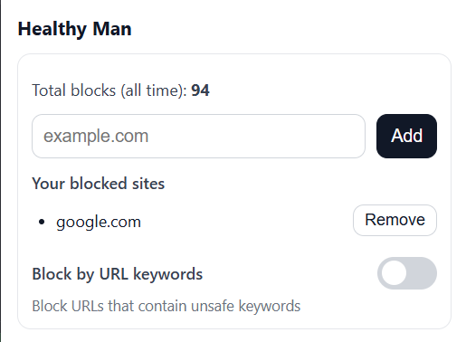

# Healthy Man - Porn Blocker Manifest V3 Extension

A Chrome extension that blocks adult content and provides a reflective space for building self-control.

## Features

### Blocking
- **Real-time Protection**: Instant blocking of adult sites as you navigate the web
- **Domain Blocking**: Block specific websites by adding them to your personal blocklist
- **Keyword Blocking**: Optional feature to block sites containing certain keywords in their URLs (works also when trying to search something via search engine)

### Safe Page
When a site is blocked, you're redirected to a Safe Page that includes:
- **Motivational Content**: Text about building self-control and understanding temptation
- **Personal Notes**: Write down your thoughts, feelings, and reflections

## Screenshots



## Folder structure

```
healthy-man-extension/
├── src/
│   ├── components/
│   │   ├── popup/
│   │   │   ├── popup.html
│   │   │   ├── popup.js
│   │   │   └── popup.css
│   │   └── safe-page/
│   │       ├── safe.html
│   │       ├── safe.js
│   │       └── safe.css
│   ├── background/
│   │   └── background.js
│   ├── content/
│   │   └── contentScript.js
│   ├── shared/
│   │   ├── constants.js
│   │   ├── utils.js
│   │   └── storage.js
│   └── data/
│       ├── blocklist.json
│       └── keywords.json
├── assets/
│   └── icon.png
├── manifest.json
└── README.md

```

## Installation

1. Download the extension files
2. Open Chrome and navigate to `chrome://extensions/`
3. Enable "Developer mode" in the top right
4. Click "Load unpacked" and select the extension folder
5. The extension will appear in your Chrome toolbar